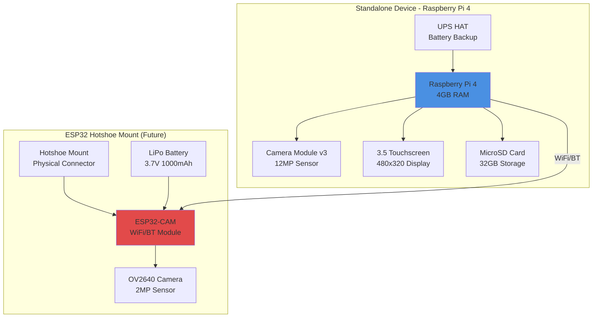
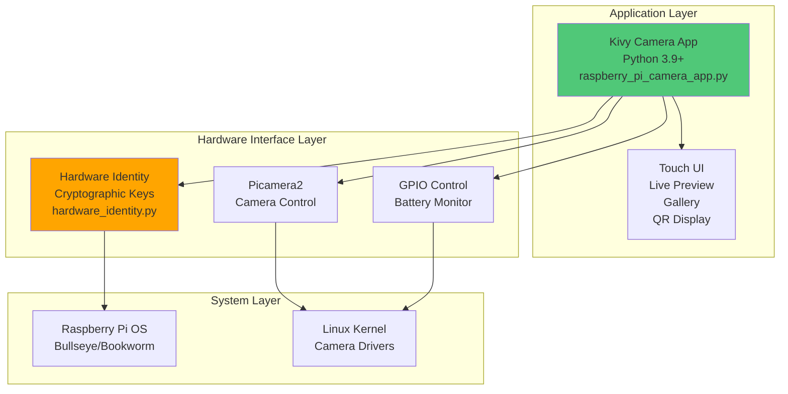
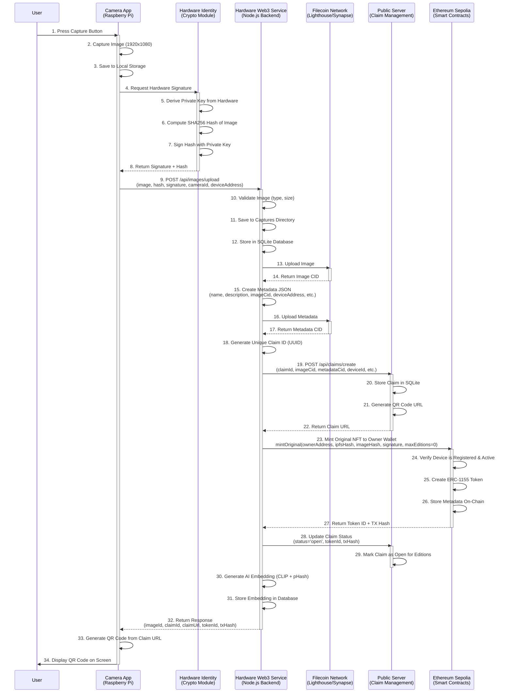
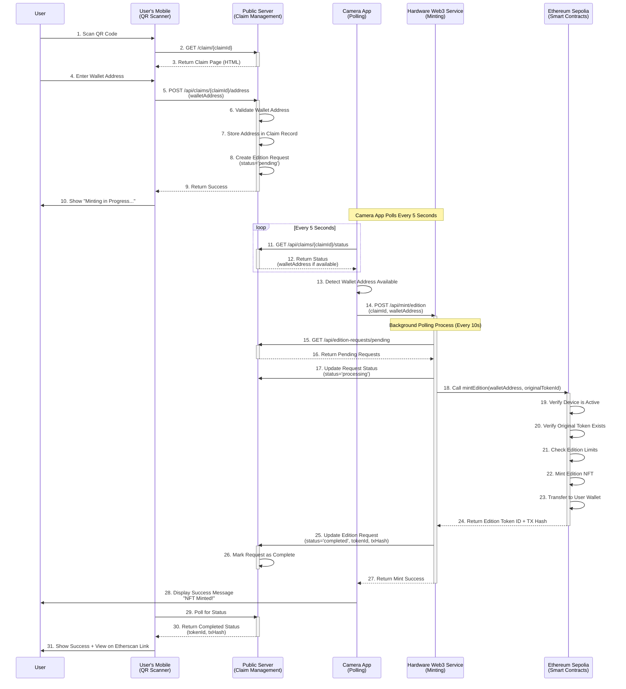
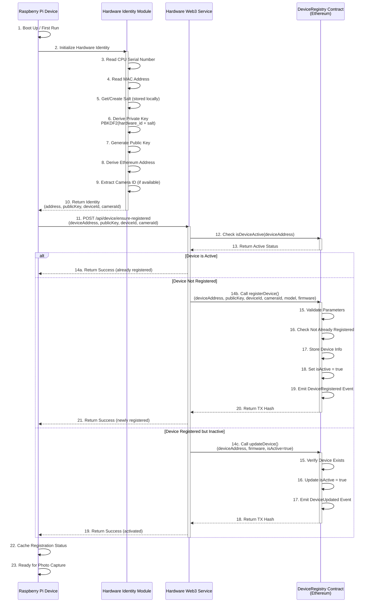
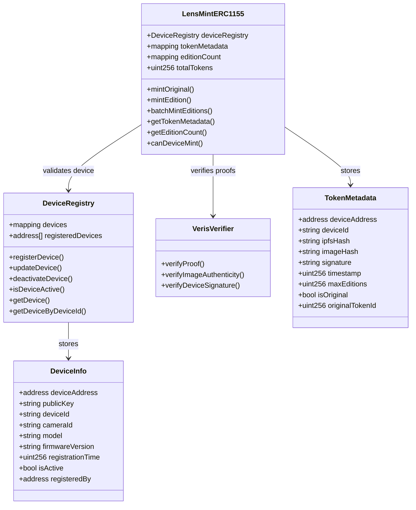
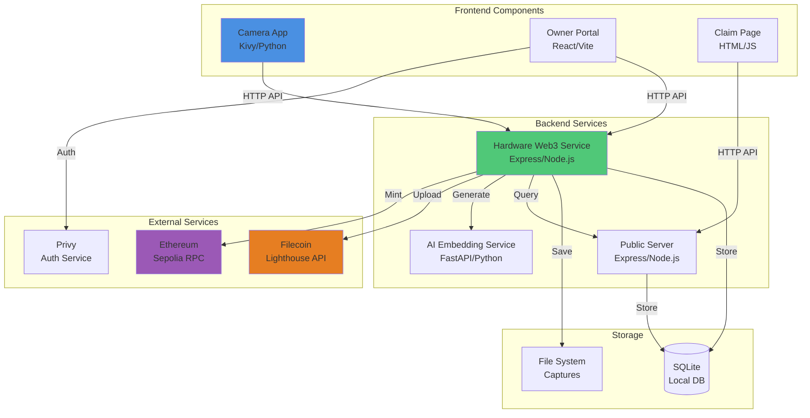
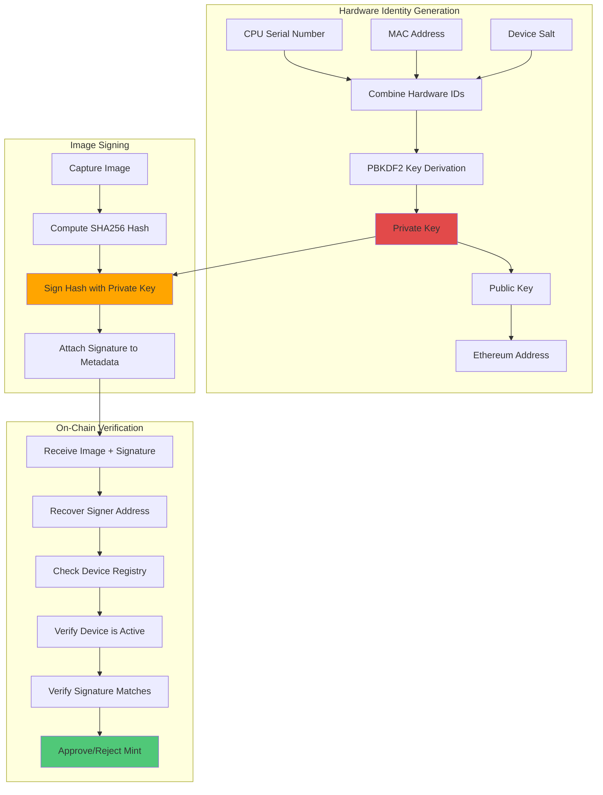

# Veris System Architecture - Detailed Diagrams

## 1. Current System Architecture (Standalone Device + ESP32 Hotshoe Mount)

### 1.1 Hardware Architecture

### 1.2 Software Stack - Standalone Device

## 2. Complete System Flow - Photo Capture to Wallet

### 2.1 Detailed Photo Capture Flow

### 2.2 User Claim & Edition Minting Flow

## 3. Device Registration & Authentication Flow

## 4. Scaled Architecture (Multiple Devices)

```mermaid
graph TB
    subgraph "Edge Devices Layer"
        DEV1[Raspberry Pi Device 1<br/>Camera + Identity]
        DEV2[Raspberry Pi Device 2<br/>Camera + Identity]
        DEV3[Raspberry Pi Device 3<br/>Camera + Identity]
        ESP1[ESP32 Hotshoe 1<br/>DSLR Mount]
        ESP2[ESP32 Hotshoe 2<br/>DSLR Mount]
    end
    
    subgraph "Backend Services Layer"
        LB[Load Balancer<br/>NGINX/HAProxy]
        
        subgraph "Web3 Service Cluster"
            WEB3_1[Hardware Web3 Service 1<br/>Node.js + Express]
            WEB3_2[Hardware Web3 Service 2<br/>Node.js + Express]
            WEB3_3[Hardware Web3 Service 3<br/>Node.js + Express]
        end
        
        subgraph "Public Server Cluster"
            PUB1[Public Server 1<br/>Claim Management]
            PUB2[Public Server 2<br/>Claim Management]
        end
        
        subgraph "AI Services"
            AI1[AI Embedding Service 1<br/>CLIP + pHash]
            AI2[AI Embedding Service 2<br/>CLIP + pHash]
        end
    end
    
    subgraph "Data Layer"
        subgraph "Database Cluster"
            DB_PRIMARY[(PostgreSQL Primary<br/>Images + Claims + Embeddings)]
            DB_REPLICA1[(PostgreSQL Replica 1)]
            DB_REPLICA2[(PostgreSQL Replica 2)]
        end
        
        REDIS[(Redis Cache<br/>Session + Status)]
        
        subgraph "Storage"
            S3[S3/MinIO<br/>Local Image Cache]
        end
    end
    
    subgraph "Blockchain Layer"
        RPC1[RPC Node 1<br/>Alchemy/Infura]
        RPC2[RPC Node 2<br/>Backup]
        
        SEPOLIA[Ethereum Sepolia<br/>Smart Contracts]
    end
    
    subgraph "Decentralized Storage"
        LIGHTHOUSE[Lighthouse<br/>Filecoin Gateway]
        FILECOIN[Filecoin Network<br/>Permanent Storage]
    end
    
    DEV1 --> LB
    DEV2 --> LB
    DEV3 --> LB
    ESP1 -.-> DEV1
    ESP2 -.-> DEV2
    
    LB --> WEB3_1
    LB --> WEB3_2
    LB --> WEB3_3
    
    WEB3_1 --> PUB1
    WEB3_2 --> PUB2
    WEB3_3 --> PUB1
    
    WEB3_1 --> AI1
    WEB3_2 --> AI2
    WEB3_3 --> AI1
    
    WEB3_1 --> DB_PRIMARY
    WEB3_2 --> DB_PRIMARY
    WEB3_3 --> DB_PRIMARY
    
    DB_PRIMARY --> DB_REPLICA1
    DB_PRIMARY --> DB_REPLICA2
    
    WEB3_1 --> REDIS
    WEB3_2 --> REDIS
    WEB3_3 --> REDIS
    
    WEB3_1 --> S3
    WEB3_2 --> S3
    WEB3_3 --> S3
    
    WEB3_1 --> RPC1
    WEB3_2 --> RPC2
    WEB3_3 --> RPC1
    
    RPC1 --> SEPOLIA
    RPC2 --> SEPOLIA
    
    WEB3_1 --> LIGHTHOUSE
    WEB3_2 --> LIGHTHOUSE
    WEB3_3 --> LIGHTHOUSE
    
    LIGHTHOUSE --> FILECOIN
    
    style DEV1 fill:#4a90e2
    style DEV2 fill:#4a90e2
    style DEV3 fill:#4a90e2
    style ESP1 fill:#e24a4a
    style ESP2 fill:#e24a4a
    style DB_PRIMARY fill:#50c878
    style SEPOLIA fill:#9b59b6
    style FILECOIN fill:#e67e22
```

## 5. Data Flow - Complete Journey

## 6. Smart Contract Architecture

## 7. Component Interaction Matrix

## 8. Security & Cryptography Flow

---

## Summary

This document provides comprehensive Mermaid diagrams covering:

1. **Hardware Architecture** - Standalone Raspberry Pi device and future ESP32 hotshoe mount
2. **Software Stack** - Complete application layers
3. **Photo Capture Flow** - Detailed sequence from button press to NFT mint
4. **User Claim Flow** - QR scan to edition minting
5. **Device Registration** - Authentication and on-chain registration
6. **Scaled Architecture** - Multi-device deployment with load balancing
7. **Data Flow** - Complete journey from capture to wallet
8. **Smart Contracts** - Contract architecture and relationships
9. **Component Interactions** - Service communication matrix
10. **Security Flow** - Cryptographic signing and verification

All diagrams are based on actual implementation details from the codebase.
