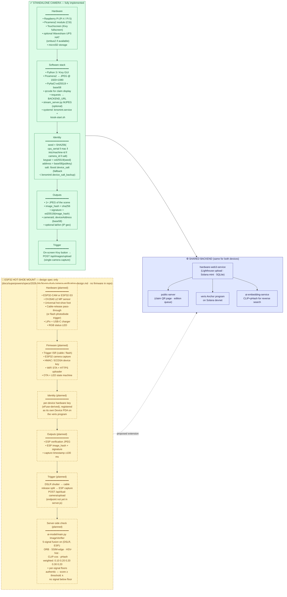
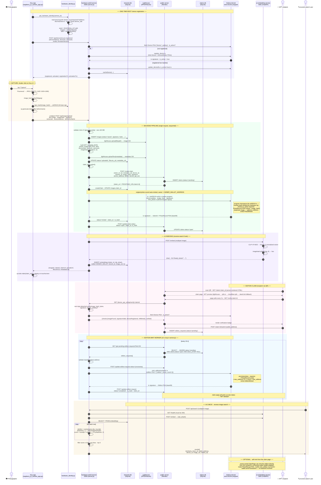

# Veris / LensMint — System Architecture

Three diagrams, grounded strictly in the current codebase (no speculative components).
Anything not in the running code (e.g. ESP32 hot-shoe firmware, multi-signal AI verifier) is explicitly labeled as such.

---

## 1. Current Production Architecture (as it actually runs today)

```mermaid
graph TB
  %% ==================== EDGE: Standalone Camera ====================
  subgraph EDGE["🎥 STANDALONE CAMERA DEVICE — Raspberry Pi"]
    direction TB
    PICAM["Picamera2<br/>raspberry_pi_camera_app.py<br/>Kivy GUI · 1920×1080 capture"]
    HWID["hardware_identity.py<br/>ed25519 keypair (PyNaCl) from<br/>SHA256(cpu_serial ‖ mac ‖<br/>machine-id ‖ camera_id ‖ salt)<br/>address = base58(pubkey)<br/>salt @ /boot/.device_salt"]
    STREAM["stream_server.py<br/>MJPEG :8081 (optional)"]
    LOC["IP Geolocation<br/>(not GPS hardware)"]
    QR["qrcode lib<br/>Renders claim QR"]
    PICAM -->|"sha256(jpg) → ed25519 sign"| HWID
    PICAM --> LOC
    PICAM --> QR
  end

  %% ==================== HARDWARE-WEB3-SERVICE ====================
  subgraph HWS["⚙️ hardware-web3-service · Node.js Express :5000"]
    direction TB
    SRV["server.js<br/>POST /api/images/upload<br/>POST /api/device/ensure-registered<br/>POST /api/search<br/>GET /api/verify/:claimId"]
    DB1[("better-sqlite3<br/>lensmint.db<br/>tables: images · claims ·<br/>devices · embeddings")]
    W3["solanaService.js<br/>@solana/web3.js + Anchor<br/>→ Solana devnet"]
    FCS["filecoinService.js<br/>@lighthouse-web3/sdk"]
    EMB["embeddingService.js<br/>HTTP client → :5001"]
    CC["claimClient.js<br/>axios → public-server"]
    DEP["deploymentService.js<br/>reads solana-program/deployment.json<br/>+ idl/veris.json"]
    HWK["getHardwareKey.js<br/>reads .device_key_export seed_hex<br/>(or spawns python3 export_key.py)<br/>→ Keypair.fromSeed"]
    POLL{{"setInterval 10s<br/>processEditionRequests()"}}
    SRV --> DB1
    SRV --> W3
    SRV --> FCS
    SRV --> EMB
    SRV --> CC
    W3 --> DEP
    W3 --> HWK
    POLL --> CC
    POLL --> W3
  end

  %% ==================== PUBLIC SERVER ====================
  subgraph PUB["🌐 public-server · Render.com :5001"]
    direction TB
    PSRV["server.js (CommonJS)<br/>POST /create-claim<br/>GET  /claim/:id (inline HTML)<br/>POST /claim/:id/submit<br/>GET  /check-claim<br/>GET  /verify-claim/:id<br/>GET  /get-pending-edition-requests<br/>POST /update-edition-request<br/>GET  /api/metadata/:id (NFT metadata JSON)"]
    DB2[("better-sqlite3<br/>claims.db<br/>tables: claims · edition_requests")]
    PSRV --> DB2
  end

  %% ==================== AI EMBEDDING SERVICE ====================
  subgraph AIE["🧠 ai-embedding-service · FastAPI :5001"]
    AISRV["main.py<br/>POST /embed<br/>CLIP ViT-B/32 (512-D)<br/>+ pHash 8×8"]
  end

  %% ==================== AI MODEL (NOT INTEGRATED) ====================
  subgraph AIM["🔬 ai-model · STANDALONE RESEARCH CODE"]
    AIMOD["main.py · ImageVerifier<br/>5-signal fusion: ORB · SSIM-edge ·<br/>HSV-hist · CLIP-cos · pHash<br/>weighted sum + per-signal floor<br/>⚠ NOT wired into pipeline"]
  end

  %% ==================== OWNER PORTAL ====================
  subgraph OP["💻 owner-portal · React + Vite"]
    direction TB
    APP["App.jsx<br/>ConnectionProvider · WalletProvider<br/>(wallet-adapter: Phantom/Solflare)<br/>cluster: devnet"]
    R1["/ → LandingPage"]
    R2["/dashboard → OwnerDashboard"]
    R3["/claim/:claimId → ClaimPage"]
    R4["/search → SearchPage"]
    APP --> R1 & R2 & R3 & R4
  end

  %% ==================== EXTERNAL SERVICES ====================
  subgraph EXT["☁️ EXTERNAL"]
    LH["Lighthouse Gateway<br/>gateway.lighthouse.storage<br/>→ Filecoin/IPFS"]
  end

  %% ==================== SOLANA ====================
  subgraph CHAIN["⛓ Solana Devnet — veris Anchor program"]
    DR["Device + DeviceIdIndex PDAs<br/>register_device · update_device ·<br/>deactivate_device"]
    L11["PhotoRecord + Edition PDAs<br/>mint_photo (requires native ed25519<br/>verify ix — instruction introspection) ·<br/>mint_edition · transfer_photo/edition<br/>PhotoRecord seeded by image_hash (dedupe)"]
    L11 -->|"requires Device.is_active<br/>+ device signer"| DR
  end

  %% ==================== EDGE FLOWS ====================
  PICAM -.->|"multipart POST<br/>/api/images/upload"| SRV
  PICAM -.->|"poll 5s<br/>GET /check-claim"| PSRV
  HWID -.->|"export_key.py · stdout"| HWK

  %% ==================== HWS FLOWS ====================
  FCS -->|"lighthouse.upload(file, apiKey)<br/>+ uploadText(metadata.json)"| LH
  W3 -->|"Connection<br/>SOLANA_RPC_URL"| CHAIN
  CC -->|"axios POST/GET<br/>CLAIM_SERVER_URL"| PSRV
  EMB -->|"HTTP form-data"| AISRV

  %% ==================== USER FLOWS ====================
  USER(("📱 End user phone<br/>scans QR")):::user
  USER -->|"GET /claim/:id"| PSRV
  USER2(("🖼 Owner browser")):::user
  USER2 --> APP
  APP -->|"wallet-adapter tx<br/>+ Anchor account reads"| CHAIN
  APP -->|"img upload"| SRV

  %% ==================== VERIFY-CLAIM CALLBACK ====================
  PSRV -.->|"GET /api/verify/:claimId<br/>(if device_api_url set)"| SRV

  classDef user fill:#fef3c7,stroke:#92400e,color:#78350f
  classDef offline fill:#fee2e2,stroke:#991b1b,color:#7f1d1d,stroke-dasharray:5 5
  class AIM offline
```

**Truth notes for this diagram:**
- Both `hardware-web3-service` and `ai-embedding-service` default to port `5001`. In practice the embedding service is overridden via `EMBEDDING_SERVICE_URL`, and the public-server runs on Render so collisions are ignored.
- "Filecoin storage" means Lighthouse IPFS — no Synapse SDK, no direct Filecoin deal-making in code.
- All on-chain state lives in the single `veris` Anchor program (`solana-program/`) — device registry, photo provenance records, and editions are PDAs; there are no SPL token mints.
- The hardware signature is verified **by the Solana runtime itself**: `mint_photo` requires a native ed25519-program instruction in the same transaction and checks it via instruction introspection.
- `ai-model/` is calibration/diagnostic code only — it is never imported by `hardware-web3-service`.

---

## 2. Device Comparison — Standalone (built) vs. ESP32 Hot-Shoe (spec only)

---

## 3. End-to-End Flow — Shutter Click → Wallet → AI Check

---

### Legend & ground rules used to build these diagrams

| Symbol / style | Meaning |
|---|---|
| Solid box, green | Code that exists and runs in this repo |
| Dashed border, amber | Specified in `docs/superpowers/specs/` but no implementation in repo |
| Red dashed | Code present but not wired into the live pipeline (`ai-model/`) |
| Numbered sequence | Exact order of operations in `server.js` upload handler |
| “poll Ns” | Real interval values from source (`CLAIM_POLL_INTERVAL=5`, edition poll = 10000 ms) |
